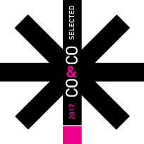

Featured in: [fastcodesign](https://www.fastcodesign.com/90125529/7-design-portfolios-that-double-as-awesome-uis), [hoverstat.es](http://hoverstat.es/features/connect-the-dots-on-timo-becker-s-portfolio), [Design made in Germany](https://www.designmadeingermany.de/2017/122935/)

Das Logo beruht immer auf den selben sieben Punkten, wird jedoch erst durch die Interaktion von Timo Becker und seinem Gegenüber komplettiert. 

1. Timo reicht seine Visitenkarte mit einem schwarzen Stift und der Bitte, die Punkte zu verbinden. 
2. Der Gegenüber verbindet die Punkte.
3. Timo zeichnet in rot eine individuelle Illustration darauf. 

Es entsteht spontan eine persönliche Verbindung.

Auf der Website wird diese Situation digital abgebildet. Da Timo nicht jederzeit mit einer Illustration antworten kann, haben wir ihn gebeten, für alle dreihundertsechzig Kombinationen Zeichnungen anzufertigen. Diese werden dann abhängig von der vom Benutzer ausgeführten Verbindung angezeigt. Dadurch, dass es sehr schwer ist, alle dreihundertsechzig Kombinationen zu erraten, entsteht trotz der Wiederholbarkeit eine persönliche Verbindung. Es macht süchtig, sich auf die Suche nach allen Kombinationen zu begeben.

Auf der [Eröffnungsfeier](/neuigkeiten/timo-launch/) zu der Website haben wir diesen Automatismus wiederum zu einer Installation verarbeitet. Auf einer großen Projektionsfläche konnten die Gäste Knöpfe drücken, um dann gedruckte Versionen der Illustrationen mit nach Haus zu nehmen.

Darüber Hinaus haben wir in unserem Büro Fotos von seinen Skizzen- und Kinderbüchern angefertigt, die auf der Website groß zur Geltung kommen.

# Technisch

Natürlich ist die Website **responsive**; funktioniert sowohl auf kleinen Telefonbildschirmen wie auch auf großen Schreibtischmonitoren. Die Bilder werden in angepassten Auflösungen ausgeliefert. So ist die website sehr schnell.

Die Malerei ist umgesetzt mithilfe von **paper.js**.

Das Framework ist **gatsby.js**. Die Website ist statisch – funktioniert ohne JavaScript. Wenn JS aktiviert ist, passieren Seitenwechsel ohne *round trip* und somit augenblicklich.

Der Quellcode kann eingesehen werden auf [github](https://github.com/voellig-ohne/timobecker).

---

Portfolio site for Timo Becker, a Berlin-based illustrator. The idea is to create a connection between the artist and his potential client. In real live Timo will

1. Pass his business card with a black pen and ask to connect the lines. 
2. The client will connect the lines.
3. Timo will add his illustration in red. 

This way every business card is an unique, individualized item.

We reproduce this process on his website, creating a  virtual connection. In the digital Version, the illustrations are prepared already. Once the user connects the dots, they immediately get an illustration by Timo Becker. It is hard to manually find all connections, so the illustration you get is still individual, there is no easy way to see them all. It is addictive to explore as many possibilities as you can find.

On the [launch party](/neuigkeiten/timo-launch/) we transformed the digital version to an installation. The guests could press physical knobs to connect the dots and take printed version home.

# Technical

Of course this website is *responsive*, working on all screen sizes. The paintings are developed using **paper.js** and the framework for the website is **gatsby.js**. The source code can be checked out at [github](https://github.com/voellig-ohne/timobecker).